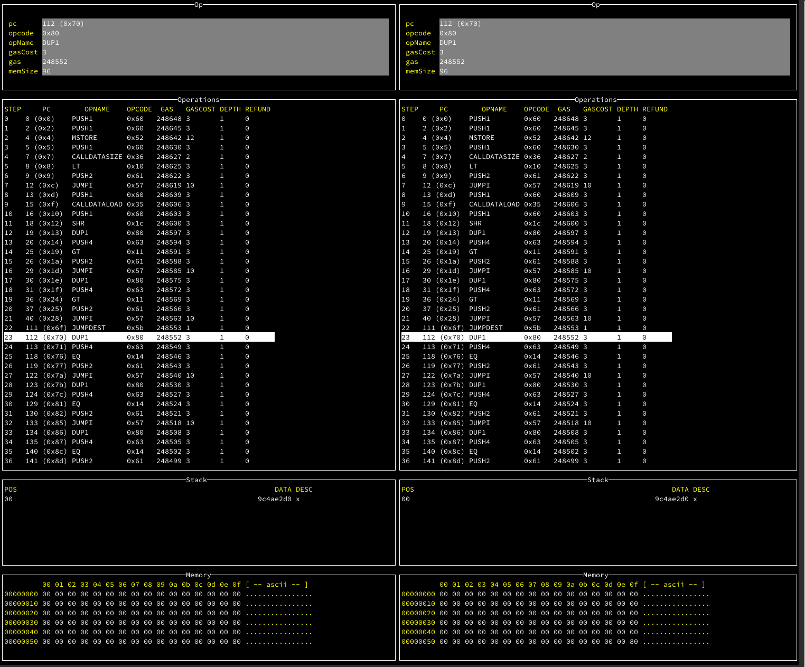
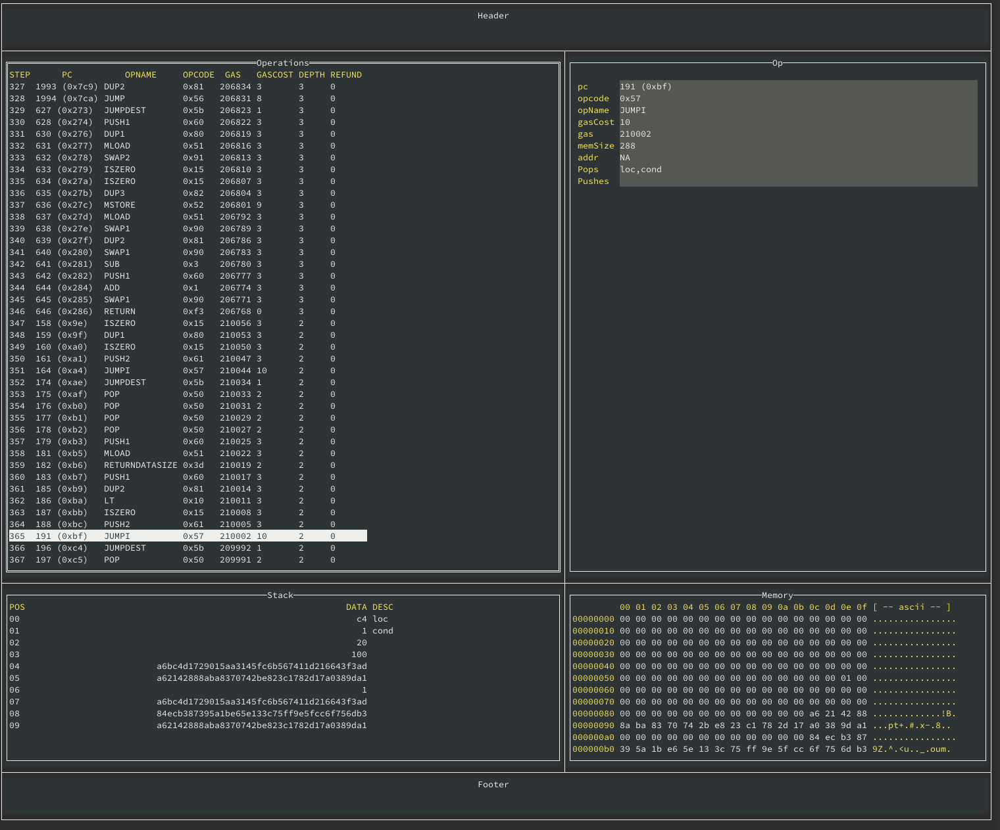

# Go qrvmlab

This project is inspired by [QRVMlab](https://github.com/ethereum/evmlab), which was
written in Python. QRVMlab featured a minimal "compiler", along with some tooling
to view traces in a UI, and execute scripts against QRVMs (gzond). 

This is a golang rewrite from scratch of that same project, this time in go-lang to be more stable 
and nice to use. 

## Status

So far, it only contains 

- a minimal "compiler", which is _not_ a proper compiler, but it can be used to create QRVM bytecode and do some basic higher level operations. 
- Some infrastructure for writing QRVM-based fuzzers

## Examples

See [examples/calltree](the calltree example) to get an idea of how to use this
thing, along with an [analysis](examples/calltree/README.md) done using 
this framework. 

# Utilities

There are a few different utilities in this repo, based on this library. 

## Tracediff

Tracediff allows you to load evm (jsonl) files and find differences. 

## Traceview

Traceview allows you to analyse an evm trace file

## Trophy list

Bugs found via the fuzzer or via tests generated using go-evmlab in general

- Nethermind erroneous gas in BLS-multiexp: https://github.com/NethermindEth/nethermind/issues/2208
- Geth error calculating BLS gas: https://github.com/ethereum/go-ethereum/pull/21253
- Besu error on EIP-2929 [bug](https://github.com/holiman/goevmlab/issues/24) and [fix](https://github.com/hyperledger/besu/pull/1468)
